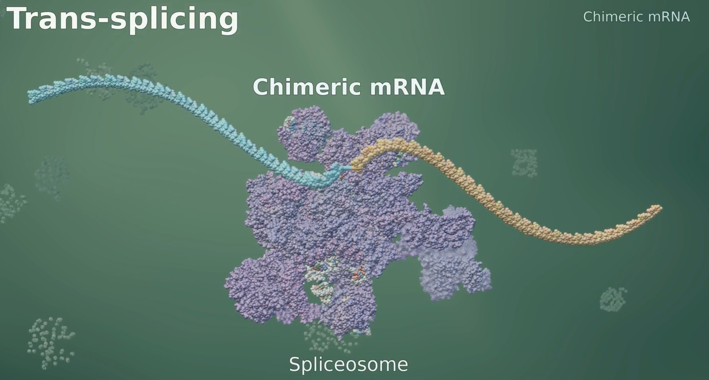

# Team Fusion: Expanding the druggable human proteome by identifying chimeric-RNA derived fusion proteins
## Background
**Event:** [WIlbe • OpenAI • NVIDIA AIxBio Hack](https://www.wilbelab.com/aibiohack)

This project is the group effort of [Amber Wu](https://www.linkedin.com/in/amberyitingwu/), [Chris Paton](https://www.linkedin.com/in/christopher-paton-192014201/), [Eva Klemencic](https://www.linkedin.com/in/evaklemencic/), [Nathan Ewer](https://www.linkedin.com/in/nathan-ewer-520027192/) and [Sasha Cheparukhin](https://www.linkedin.com/in/cheparukhin/), taking place in person from 18-20 September 2026 at WilbeLABS, White City, London.

It was awarded the first place prize of $10,000 from a panel of 6 judges from NVIDIA, OpenAI, and Amino Collective. Now, we are taking the due time to improve the science. The publication will be linked **here** when complete. Collaborations are welcome – please contact [Nathan Ewer](https://www.linkedin.com/in/nathan-ewer-520027192/) .

## Project

[](animation/trans_splicing_v4_1080p_30s.mp4)

*Click the poster above to play the 30s animation, or [download it directly](animation/trans_splicing_v4_1080p_30s.mp4).*

**Problem Statement:** The central dogma of molecular biology states DNA is transcribed into RNA, which is translated into protein. In mammalian cells, mRNA is first expressed as pre-mRNA, containing introns and exons. Combinatorial selection of which subset of exons to include during splicing allows many mature mRNA molecules to originate from a single genomic loci. Crucially, splicing occurs *in-cis*, i.e. on a single molecule.

Recently, [Venezia et al 2026 ](https://www.nature.com/articles/s41586-026-10982-x) demonstrate *trans-splicing*, whereby introns and exons from two **different** pre-mRNAs are fused during splicing into a single **chimeric RNA** (chRNA) molecule, **leads to functional gene products**. Notably, Gsdmd-Tmem106a modulates the balance between sepsis lethality and antibacterial defence.

This is important as historically they have been **mostly characterised as artefacts**: for instance, chRNA's can emerge artificially during reverse transcriptase template switching, and they are not annotated in reference transcriptomes resulting in multi-mapping during genome alignment

Therefore, fusion proteins **potentially represent an entirely novel class of drug target.**

In this mini-project, we establish the first steps towards mining the fusion-proteome at scale, considering both sequence and structure led approaches and creating a fusion protein dashboard.

## Project Contributions

| Contribution | What was delivered | Evidence and code |
| --- | --- | --- |
| **RNA ranking** | Read/junction assessment and a frozen RNA-only shortlist; a separate gene-pair RNA/Hi-C benchmark | [Mouse pilot workflow](workflows/mouse-pilot/README.md), [benchmark model card](results/classifier/MODEL_CARD.md) |
| **Disorder and folding comparison** | Sequence-based disorder/domain analysis of conditional peptide hypotheses, plus a Gsdmd–Tmem106a comparison across Boltz2, AlphaFold2 and ESMFold | [Cohort results](results/structure_campaign/RESULTS.md), [model disagreement](results/structure_campaign/cross_model_gsdmd/README.md), [analysis source](scripts/structure_campaign/README.md) |
| **Fusion-protein dashboard** | Linked RNA, exon-origin and predicted-structure views for ten mouse pilot hypotheses and a separate literature control | [Public dashboard](https://chimeric-rna-exon-structures.a-cheparukhin.chatgpt.site)

## Team Contributions

- C.P and N.E concieved and initiated the project.
- S.C led DevOps aspects of the project, including brev node setup. Others made comment he has a lovely singing voice.
- N.E concieved and executed the Hi-C classifier and structure-disorder analysis.
- A.W, C.P, and E.K conceived and implemented the RNA ranking pipeline and chRNA dashboard.

## View the outputs

From the repository root, with Python 3:

```sh
python3 scripts/demo/serve.py
```

Open `http://127.0.0.1:8000/dashboard/` for the presented structure viewer or `http://127.0.0.1:8000/demo/` for the gene-pair ranking explorer. The dashboard needs internet for its pinned 3Dmol library; it needs no API key, GPU, or live inference. The optional three-case evidence-review companion is at `/demo/review/`.

Full disorder profiles, model coordinates, report assets and distinct run evidence are **GitHub release assets, outside Git history**. [Download and restore them](preservation/controller-20260920/README.md) into the existing workflow paths. After restoration, the structure report is at `/results/structure_campaign/report/`. Repository summaries can be read without downloading those data.

## Reproduce

For the gene-pair benchmark, use Python 3.12 and the locked CPU environment:

```sh
uv venv --python 3.12 .venv
uv pip install --python .venv/bin/python -r requirements-core.lock
.venv/bin/python scripts/reproduce.py --download
.venv/bin/python -m pytest -q
```

`--download` fetches pinned study tables and annotation while reusing the bundled Hi-C feature table. With input caches already restored, omit it. To rebuild contacts from the public processed Hi-C files, install the optional native reader from `requirements.lock`, then use `--download --download-hic`. `--rna-only` runs the explicit RNA-only fallback. These commands do not provision GPUs or invoke paid APIs.

- [Read/junction workflow and frozen rules](workflows/mouse-pilot/README.md)
- [Disorder/folding analysis and optional dependencies](scripts/structure_campaign/README.md)
- [Dashboard rebuild from bundled inputs](dashboard/README.md)
- [Restore and verify saved evidence](preservation/controller-20260920/README.md)
- [Documentation link and artifact checks](scripts/check_docs.py): `python3 scripts/check_docs.py`

## Other retained work

The [three recorded evidence reviews](scripts/review/README.md), [bounded Parabricks alignment](results/compute/STATUS.md), [separate 383-model folding supplement](results/folding_expansion/README.md), [partial cross-species study](workflows/cross-species/README.md), and K562 extension are inspectable supporting work. They do not add extra headline claims to the FINAL tab or establish full-cohort completion, conservation, measured scientific utility, or new protein function.

The current Google Slides deck is the presentation. Superseded local decks, previews and narrated exports were removed after checking their copies in the earlier published release. [Presentation scope and remaining checks](docs/submission/README.md) · [Open questions](GAPS.md).
