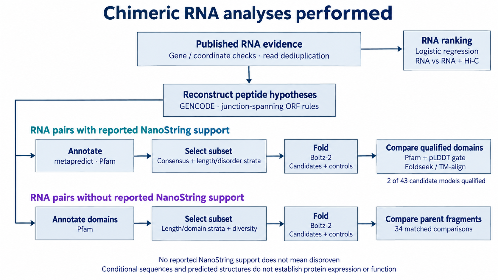

# Chimeric RNA workflow diagram

[Download the presentation PNG](chimeric-rna-workflow.png).

The diagram separates RNA ranking from two protein-analysis cohorts: pairs with reported NanoString support and pairs without reported support. Missing reported support does not mean disproven. Peptides are conditional reference reconstructions, not experimentally confirmed proteins.

## Evidence behind the diagram

- [RNA ranking](../../results/classifier/MODEL_CARD.md): logistic regression using RNA features, compared with RNA plus Hi-C; no Pfam or folding features enter the ranker.
- [Reference reconstruction](../../results/structure_campaign/cohort/METHODS.md): GENCODE-based junction-spanning ORF hypotheses.
- [Supported-cohort selection](../../results/structure_campaign/selection/manifest.json): consensus hypotheses, length/disorder-stratified sampling and a published reference. Consensus means agreement across compatible reference reconstructions, not experimental confirmation.
- [Supported-cohort results](../../results/structure_campaign/RESULTS.md): metapredict, Pfam, Boltz-2 and structural comparison. Only 2 of 43 first-pass single-sequence candidate models had qualifying domains; this denominator excludes other protocols and cohorts.
- [Structural-comparison rules](../../results/structure_campaign/diversity/METHODS.md): contiguous Pfam spans of at least 50 residues, with at least 80% of residues at pLDDT >=70; Foldseek/TM-align comparisons additionally require TM-score >=0.5 and coverage >=0.8 on both spans.
- [Separate folding cohort](../../results/folding_expansion/README.md): length/domain-stratified random and domain-diversity-enriched selection, Boltz-2 and 34 matched parent-fragment comparisons. Disorder was not used in this selection. There were 383 verified models and 117 missing predictions at cutoff.

Arrows summarize executed analysis modules; they do not imply complete raw-read processing, universal filtering, or that every selected input yielded a model. Parent controls accompany selected candidates. Predicted structures do not establish expression or function.

Created with the built-in image-generation tool and checked against the linked execution records. Scientific pictograms are intentionally omitted; this is a text-only presentation asset.
