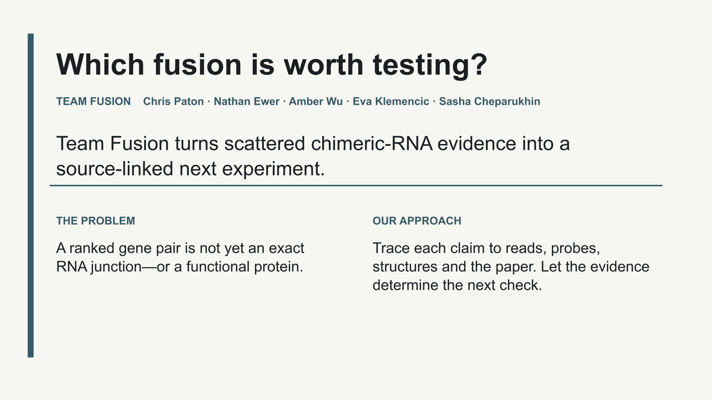
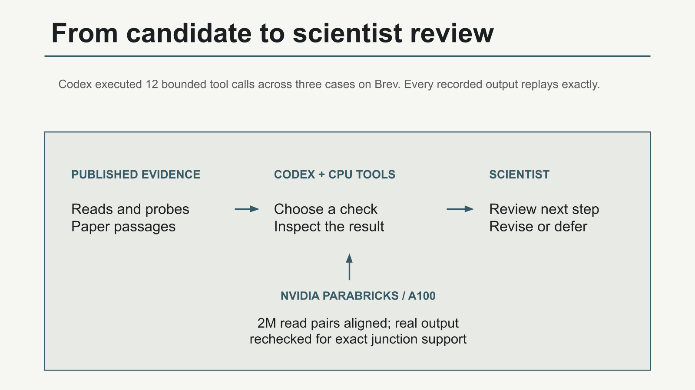
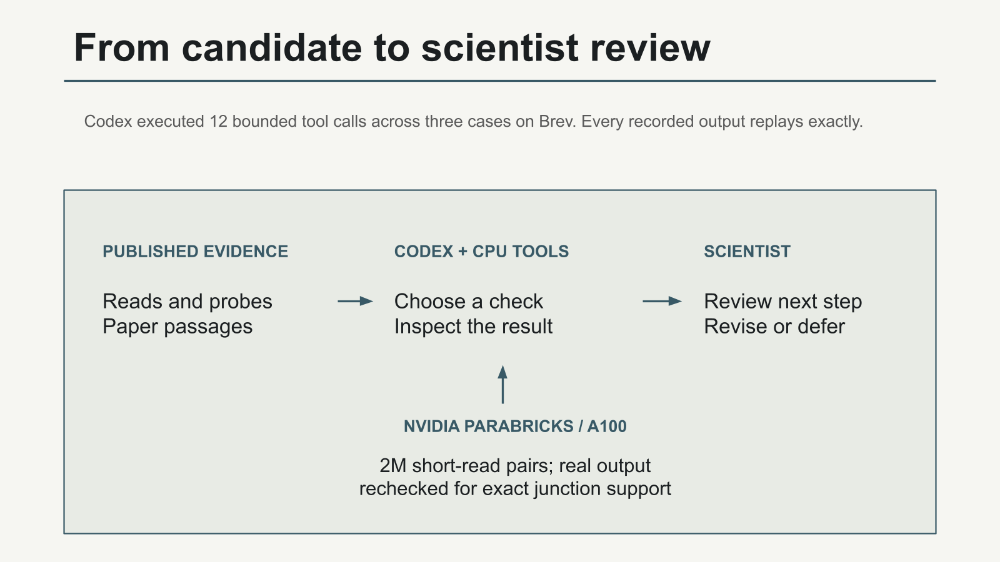
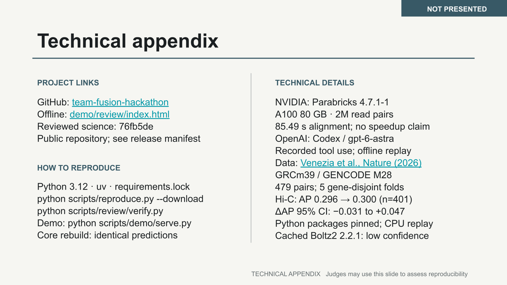

# Submission deck and five-minute story

[Open the editable organiser-template deck](https://docs.google.com/presentation/d/1bnxMDj1dVAnIauboX6clVpuLMnzJVSns28jrIecd8QE/edit).

Three presented slides plus one non-presented technical appendix. The original organiser template is unchanged. This draft uses the native template typography and layout; all four native rendered slides were inspected. The slide PNGs are snapshots, not screenshots of the application demo.

## Short fallback walkthrough

[Play the 2:17 evidence walkthrough](evidence-walkthrough.mp4) · [Transcript](walkthrough-transcript.md). This uses synthetic narration and inspected native slide snapshots. It is not a browser recording, live model call, or completed human rehearsal. Full decoding and representative encoded frames were checked; pronunciation has not received independent listener review.

## Present

- **0:00–0:50 — Problem:** scientists need a testable junction, not only a ranked gene pair.
- **0:50–2:00 — Workflow:** Codex selected and executed bounded evidence checks; actual Parabricks output contributes to review. This is a recorded run with exact offline replay, not live inference.
- **2:00–4:50 — Decision:** Psap–Lgals3 shows a 924-nt endpoint discrepancy. Reconcile source alignment and coordinate convention before choosing the junction assay. This does not prove an artifact or probe error.
- **4:50–5:00 — Close:** propose independent scientist review and prospective utility evaluation.

The complete timed script is in [speaker-notes.json](speaker-notes.json) and the native deck. These are planned timings, not completed rehearsals.

[Scientific claim audit, judge questions and independent-review instructions](SCIENTIFIC_REVIEW.md).

## Evidence and limits

Evidence snapshot: `644e3f8`. Scientific references are in the script and [slide-text.json](slide-text.json). Hi-C has no established gain. The three cases are selected demonstrations. Human review and measured utility are pending. Local review receipts are self-reported.

The repository and deck are private. Judge access must be granted before submission; this folder does not establish external access. Final release pin and downloaded submission bundle remain open. A native PDF export returned an unmaterialized file reference, so only the inspected native thumbnails are archived here. Demo browser validation remains separately open; slide inspection does not substitute for it.

## Visual record

