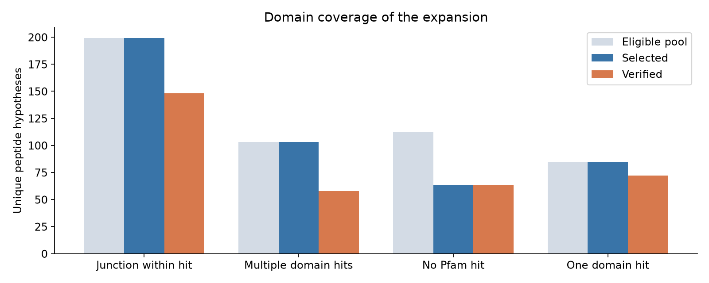
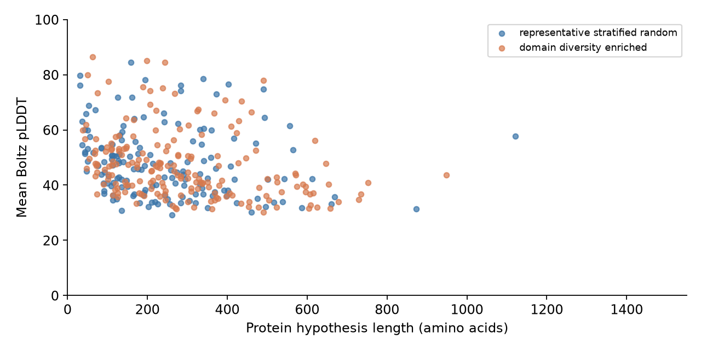

# Verified folding supplement

**383 of 500 selected models passed artifact validation:** 341 conditional candidate peptides spanning 223 RNA pairs, plus 42 donor-parent fragment controls. There were 117 missing predictions at the cutoff. These are computational models of reference-sequence hypotheses, not experimentally validated proteins.

| Selection arm | Planned | Verified | Missing | Median mean pLDDT |
| --- | ---: | ---: | ---: | ---: |
| Length/domain-stratified random | 200 | 151 | 49 | 45.55 |
| Domain-diversity enriched | 250 | 190 | 60 | 43.97 |
| Matched parent-fragment controls | 50 | 42 | 8 | 51.74 |

Candidate selection covers pairs without reported NanoString support; that means support is unknown, not biologically negative. The source census reconstructed 696 annotated-start peptide hypotheses across 390 of the 479 probe-panel pairs. Selection was limited to 1,500 amino acids and used Pfam 38.2 hits. Disorder was not used in the recovered selection; a broader parent-domain scan did not finish.

Only 25 of the 341 candidate models have mean pLDDT ≥70. This descriptive result does not estimate biological foldability or disorder. One random stratum received no allocation, the enriched arm is deliberately selected, and cutoff-related missingness may bias completed outputs. No population prevalence or causal comparison between arms is supported. Missing predictions are not low-confidence predictions.

[34 matched parent-fragment comparisons](parent_fragment_comparisons.tsv) use exact inherited residue correspondence. Isolated-fragment context and model uncertainty limit interpretation; these comparisons do not demonstrate a novel fold or biological function.

## Reproduce and inspect

[Download the immutable archive](https://github.com/cheparukhin/team-fusion-hackathon/releases/download/folding-evidence-2026-09-20/folding-expansion-20260920.tar.gz). It contains all model coordinates, confidence arrays, input sequences, selection and source mappings, command logs, pinned dependency records and verifier. [Archive checksum](archive.json) · [File manifest](SHA256SUMS.json) · [Independent integration receipt](integration_validation.json).

After extraction, install the recorded verification dependencies in an isolated environment and run `python scripts/local_verify_report.py` from the extracted snapshot. It validates existing models and rebuilds the report without inference or cloud provisioning. Re-running modifies that extracted report; keep the original archive intact. Model paths in [verified_models.tsv](verified_models.tsv) resolve relative to the extracted archive root, not this summary directory.

Integration checked all 2,211 manifest hashes, independently parsed all 383 models, and reran the packaged verifier from a clean extraction. All model rows and all 34 comparison rows matched the frozen report exactly. No new GPU work was performed.

Protocol: Boltz2 2.2.1, single sequence, three recycles, 200 sampling steps, one sample, step scale 1.5, full PAE. Seed 20260919 resets per ordered batch of up to eight; this differs from per-peptide seeding in prior runs. Inference cutoff: 11:20:30 UTC; worker shutdown cutoff: 11:22 UTC on 20 September 2026. Compute cleanup receipts are separate from scientific validation.
