# Figure guide: generation, evidence, and interpretation

[PowerPoint gallery](chRNA_gallery.pptx) · [PowerPoint-rendered PDF](chRNA_gallery.pdf) · [Contact sheet](gallery_contact_sheet.png) · [Structure methods](../structures/METHODS.md)

Commands below run from the repository root. Rebuild diagram inputs with `.venv/bin/python scripts/presentation/build_candidate_examples.py`, then verify the 118-aa reconstruction with `.venv/bin/python scripts/presentation/verify_reference_orf.py`. The gallery is generated by `scripts/presentation/build_gallery.py`; its figure manifest records data sources, caveats and input hashes.

This gallery explains a retrospective **reported-NanoString-support prioritization experiment**. It does not establish new chRNAs, protein folds, biological function, or druggability. Blue (`#0000FF`) denotes the first RNA parent; red (`#D22D27`) denotes the second. For model-comparison plots, the plot legend defines the same colors explicitly; they are not evidence grades.

The PowerPoint is the presentation artifact; individual gallery images are available for reuse. Charts and gene diagrams are regenerated from saved tables and model outputs, not traced from the paper screenshot. The paper image supplied by the user is a layout/color reference. Its chimera structure is an **AlphaFold 3 prediction**, as stated in Fig. 3a and the paper's structure methods, not an experimentally solved chimeric protein.

## 1. Workflow: published evidence → held-out ranking → inspectable candidates

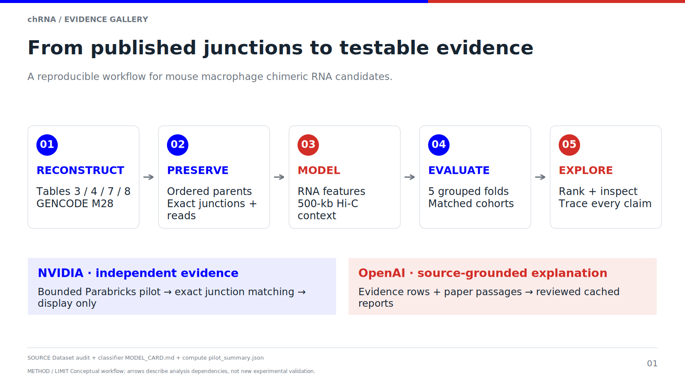
[Editable/vector figure](gallery/01_workflow.svg)

**Generation.** Editable boxes and arrows distinguish published inputs (direct-RNA calls, probe designs and reported support, processed Hi-C) from this project's reconstruction, feature extraction, grouped evaluation, GPU pilot, and evidence explorer. Input files and checksums are in `../dataset_reconstruction/manifest.json`, `../hic/feature_manifest.json`, and `../compute/pilot_summary.json`.

**Interpretation.** Long-read evidence proposes candidates, the independent assay's published list defines the evaluation label, and Hi-C provides a regional contact prior. The GPU short-read evidence and literature reports are displayed separately; neither supplies a training label or feature. Upstream sequencing and the paper's wet-lab experiments were not rerun here. The source paper used direct RNA sequencing, reducing dependence on reverse-transcription-based evidence, followed by orthogonal assays.

## 2. Cohort reconstruction and missingness

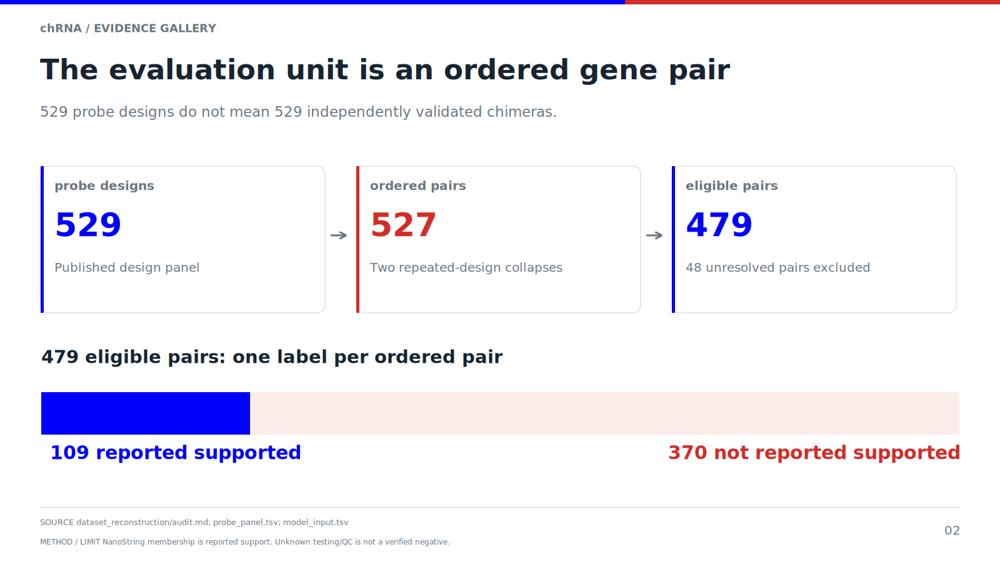
[Editable/vector figure](gallery/02_cohort.svg)

**Generation.** Counts come from the audited panel tables: 529 probe designs collapse to 527 ordered pairs; 48 pairs absent from the supplied long-read catalogues remain unresolved candidate/control entries and are excluded. The eligible dataset has 479 pairs, of which 109 are reported NanoString-supported. Complete three-replicate Hi-C evidence is available for 401 eligible pairs, including 92 reported positives.

**Interpretation.** These are distinct units: designs, pairs, and assay-reporting labels. The 48 excluded pairs are not demonstrated biological negatives. Neither absence from the positive list nor unknown assay QC is a confirmed failed assay. Missing Hi-C is unavailable evidence, not zero contact. See `../dataset_reconstruction/audit.md` and `PATH_MIGRATION.md` in that directory.

## 3. Evidence units: pair, junction, ORF, and protein

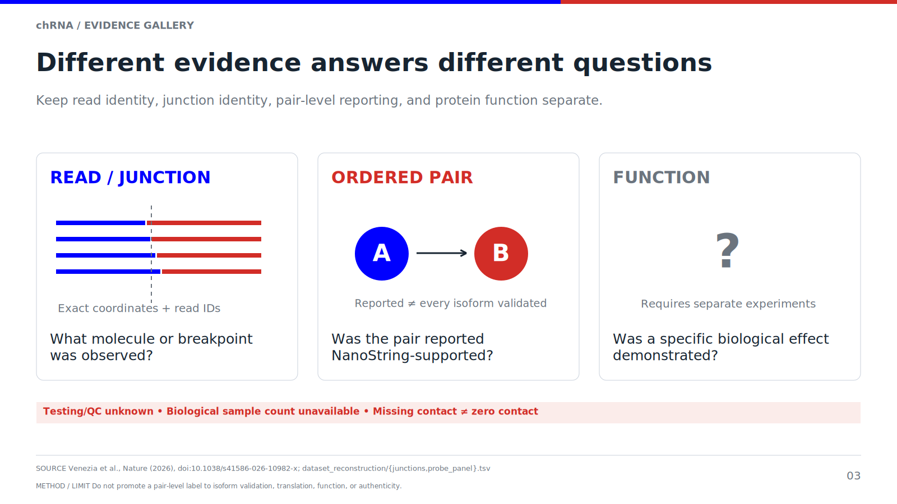
[Editable/vector figure](gallery/03_evidence_units.svg)

**Generation.** The schematic links an ordered gene pair to sequence-mapped junction probes, a conditional translated ORF, and structural evidence. Source records are `probe_junctions.tsv`, `probe_sequence_mapping.tsv`, and the candidate-specific structure provenance.

**Interpretation.** Pair-level NanoString reporting cannot validate every junction or transcript isoform. A junction alone does not specify a productive protein. A predicted fold cannot validate the originating RNA or show that it is translated. The diagram is conceptual; arrow lengths do not represent measured causal effects or assay sensitivity.

## 4. Gsdmd–Tmem106a: exon composition and a 118-residue reconstruction

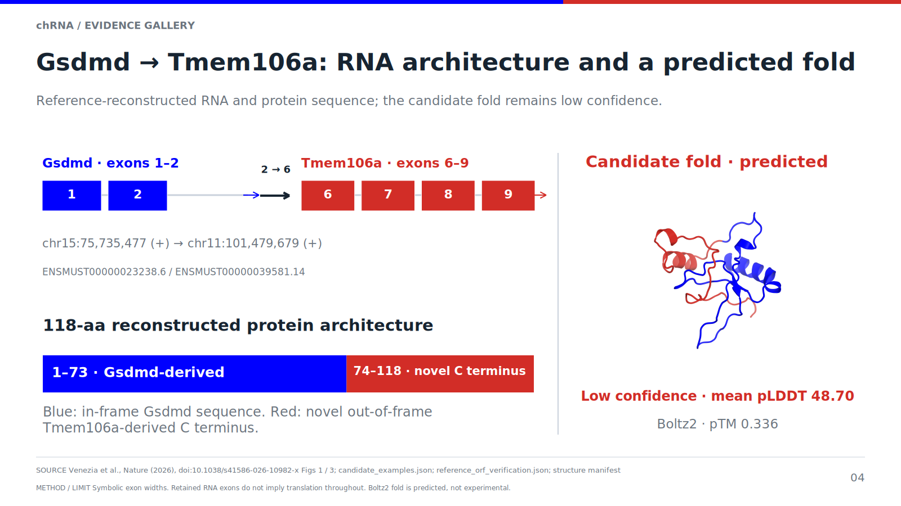
[Editable/vector figure](gallery/04_gsdmd_architecture.svg)

**Generation.** `scripts/presentation/build_candidate_examples.py` joins exact 60-nt probe-half mappings to GENCODE M28 exon annotations. Its representative transcripts are ENSMUST00000023238.6 and ENSMUST00000039581.14: Gsdmd exon 2 joins Tmem106a exon 6. All transcript alternatives, exon intervals, strands, and 1-based terminal retained coordinates are preserved in `candidate_examples.json`. Exon box widths are schematic, not genomic scale.

`scripts/presentation/verify_reference_orf.py` independently reconstructs the joined transcript from the pinned M28 transcript FASTA, verifies the exact 120-nt probe sequence across the join, and finds the 118-aa junction-spanning ORF consistent with the paper's architecture. Its protein SHA-256 is `f0766d124b52f0061597ce4e822e9275a04152df574f9a512631a0fa6ed8a2fa`, identical to the cached Boltz2 input. See `reference_orf_verification.json`.

The right-hand cartoon uses the verified cached Boltz2 coordinates, with low confidence stated alongside it; it is not the paper's AlphaFold 3 rendering. The experimental parent comparison and residue-level confidence are expanded in Figure 11.

**Interpretation.** Following the paper's labeling, residues 1–73 are the retained GSDMD region and residues 74–118 are a novel out-of-frame Tmem106a-derived tail. This is not a fusion of the two normal parental protein sequences. The source sequence is a reference reconstruction matching published constraints; an author-supplied complete sequence file was not obtained. Its reconstruction is a positive-control example, not a new discovery.

## 5. Additional gene-diagram examples

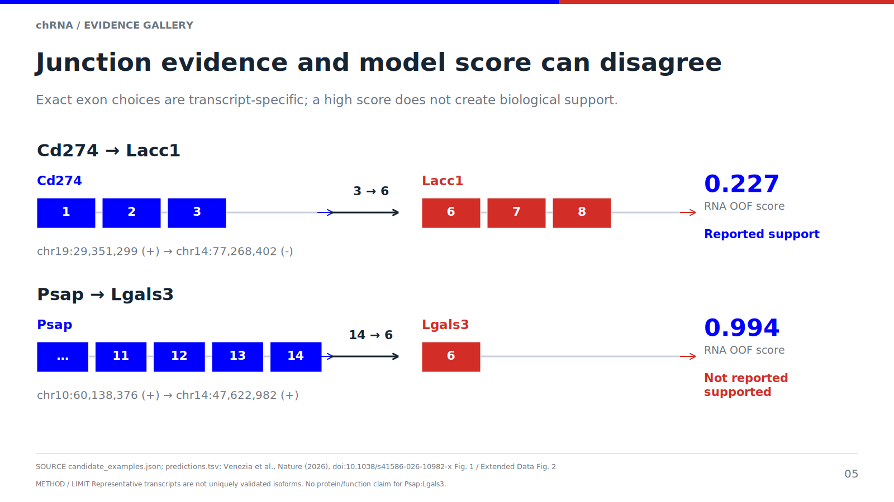
[Editable/vector figure](gallery/05_candidate_contrasts.svg)

**Generation.** The same exact-probe/GENCODE method yields Cd274 exon 3 → Lacc1 exon 6 and Psap exon 14 → Lgals3 exon 6. Representative transcripts, coordinates and alternatives are in `candidate_examples.json`. The representative transcript is the lexicographically first exact-probe match; this deterministic display choice does not assert that the full isoform was uniquely identified. Scores and support labels come directly from saved held-out predictions.

**Interpretation.** Cd274–Lacc1 is a traceable paper example. Psap–Lgals3 contrasts a high model score with absence from the reported-supported list. The diagrams visualize RNA junction architecture, not validated protein ORFs. Neither example is called newly discovered, confirmed false, or structurally validated. No protein translation or frame labels should be inferred unless a candidate-specific ORF has been established separately.

## 6. Gene-disjoint evaluation

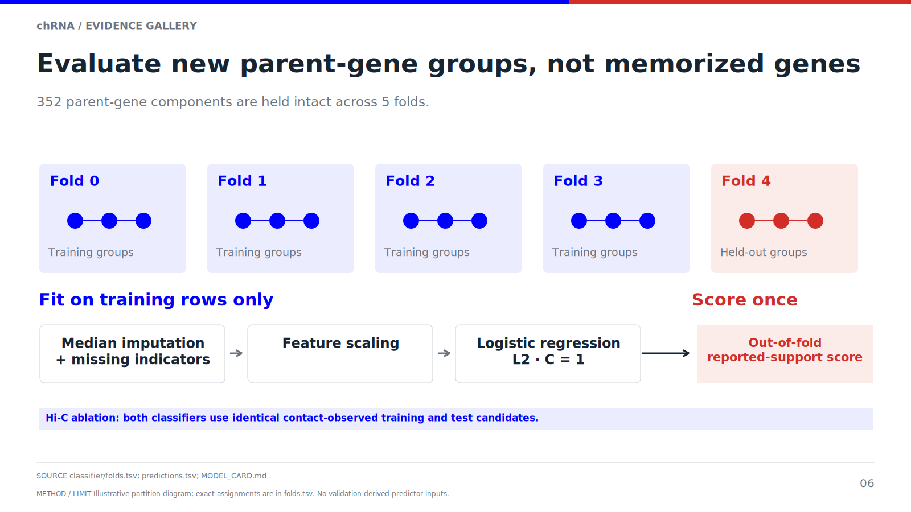
[Editable/vector figure](gallery/06_leakage_control.svg)

**Generation.** Connected components formed by shared parent genes define 352 groups across the 479-pair panel. Five fixed folds keep each component intact. Logistic regression uses fixed L2 regularization (C=1), fold-local imputation/scaling, long-read support, chromosome relationship, and genomic separation. Sample recurrence is unavailable and supplies no signal. Fold assignments are in `../classifier/folds.tsv`; the model card records the exact procedure.

**Interpretation.** Shared parent genes cannot cross train/test boundaries, reducing an important leakage route. The diagram illustrates grouping, not a newly fitted graph model. The primary Hi-C comparison trains and evaluates both models on the same 401 complete-contact pairs within the original folds; the separate 479-pair RNA model provides the missing-Hi-C fallback. This is not unrestricted arbitrary-modality prediction.

## 7. Average precision and the Hi-C increment

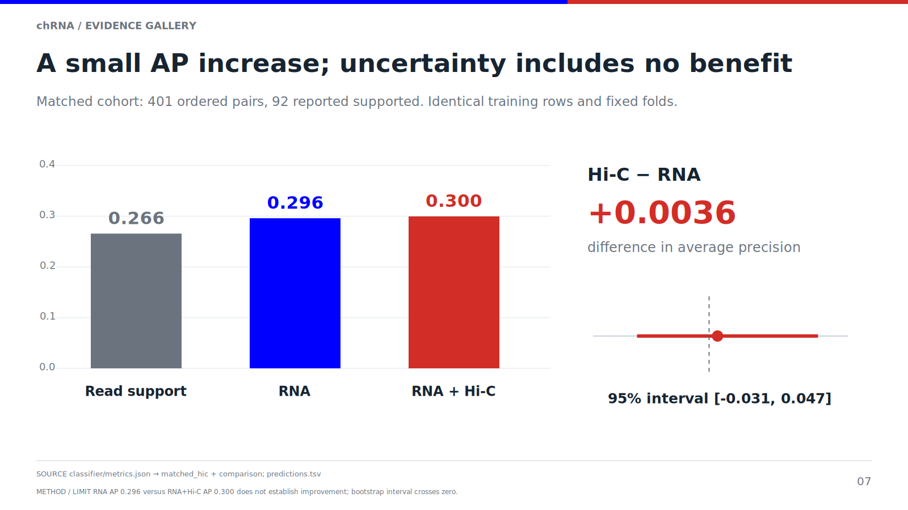
[Editable/vector figure](gallery/07_average_precision.svg)

**Generation.** Figures read saved out-of-fold predictions and `../classifier/metrics.json`. On the matched 401-pair cohort, average precision is 0.29595 for RNA features and 0.29959 with Hi-C. Their paired difference is 0.00364; 1,000 connected-component bootstrap resamples of the saved predictions give a 95% interval of [−0.03104, 0.04689]. The bootstrap describes fixed held-out predictions, not model-retraining uncertainty.

The added contact feature uses 500-kb KR-normalized matrices from three control-siRNA/LPS Hi-C replicates. An 11×11 window contributes the median central 3×3 contact divided by the median 64 corner pixels, followed by the documented averaging and log2(0.5 + enrichment) transform. Undefined/invalid KR bins, unavailable windows and zero background remain missing. The paper pooled replicates before processing; this pilot averages independently normalized replicate ratios, a documented deviation.

**Interpretation.** The interval spans zero: this experiment does **not establish an improvement from Hi-C**. Scores predict reported support within a selected panel, not calibrated probabilities of RNA authenticity. Coarse regional contact and assay timing differences limit mechanistic interpretation. The feature encodes a biological prior; it does not establish causality.

## 8. Top-20 screening and the interchromosomal subset

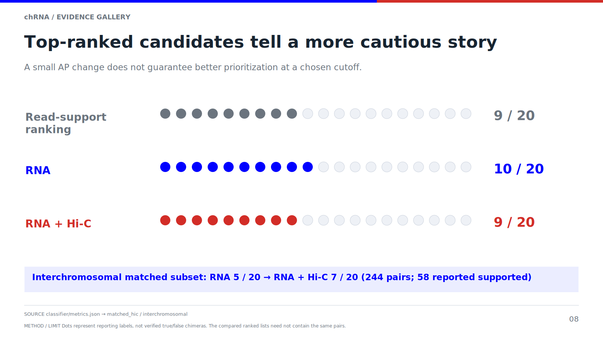
[Editable/vector figure](gallery/08_top20.svg)

**Generation.** Read-support baseline, RNA model, and RNA+Hi-C rankings use saved scores and deterministic tie breaking. On the matched cohort, the top 20 contain 9, 10 and 9 reported-supported pairs, respectively. The interchromosomal subset is reported separately rather than letting local readthrough-like cases substantiate a trans-splicing claim.

**Interpretation.** A small AP increase does not imply a better practical shortlist: the Hi-C model retrieves one fewer reported-supported pair in the matched top 20. These are descriptive, prespecified screening summaries, not optimized cutoffs or independent biological validation. Full-panel and matched-cohort results must not be mixed in one unqualified comparison.

## 9. Executed NVIDIA short-read pilot

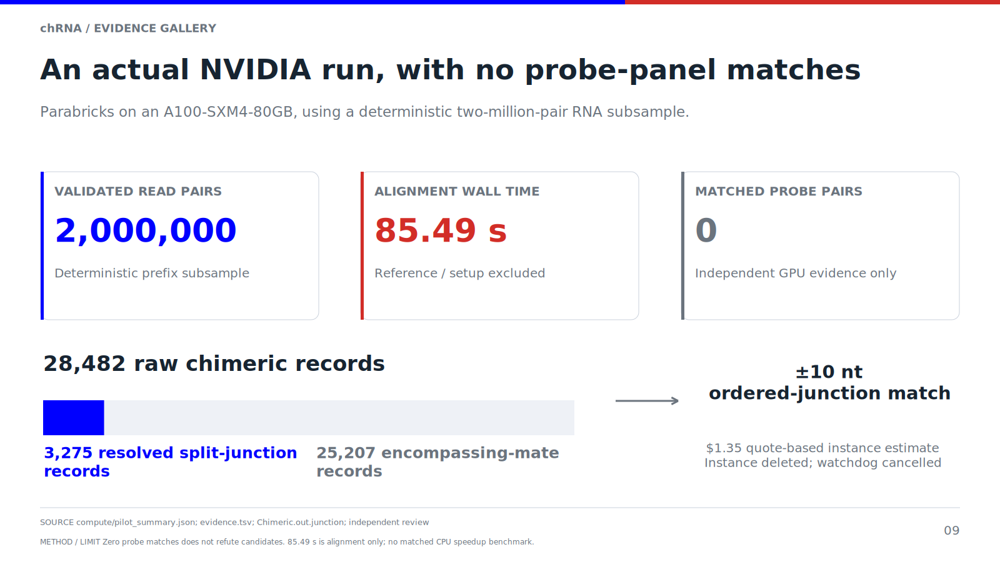
[Editable/vector figure](gallery/09_nvidia_pilot.svg)

**Generation.** The selected Parabricks 4.7.1-1 run aligned exactly 2,000,000 validated paired 151-nt reads from SRR37513722 on an A100 80 GB. Alignment wall time was 85.49 s, excluding reference setup. BAM integrity and exported hashes were verified. Of 28,482 raw chimeric records, 3,275 are split-junction records and 25,207 are encompassing-mate records. The matcher excludes encompassing mates, handles both read orientations, and requires both endpoints within ±10 nt with matching chromosomes/strands. It found zero probe-panel junction matches; an independent implementation confirmed that result.

**Interpretation.** This demonstrates an executed GPU evidence workflow, not a sensitivity estimate or a CPU speedup. The two-million-pair run contains the earlier 200,000-pair prefix; their counts must not be added as independent samples. Non-detection in this bounded, deterministic subsample does not refute the candidate RNAs. The temporary instance was deleted; its lifecycle cost was estimated at $1.35 from the quoted rate, not an invoice.

## 10. Source-grounded candidate reports and explorer

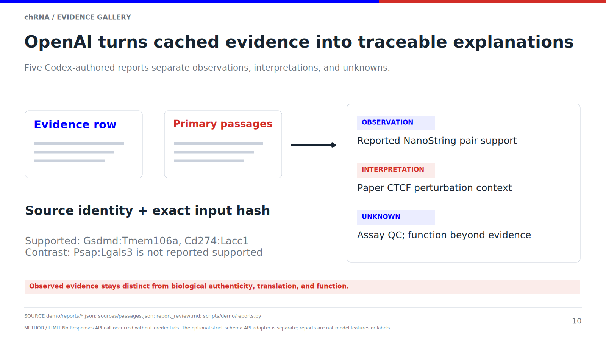
[Editable/vector figure](gallery/10_openai_reports.svg)

**Generation.** The explorer reads audited tables, exact junction/probe evidence, held-out scores, and separately attached GPU results. Five reports were authored by the OpenAI Codex agent from cached evidence and primary-source passages, with prompts, model identifier, input hashes and citations retained. Other deterministic summaries are labeled. The optional Responses API adapter exists but was not invoked without a key.

**Interpretation.** These reports help a viewer inspect evidence and unknowns. They do not introduce new measurements, train the classifier, or establish functional mechanisms. A presentation screenshot is a cached view of real artifacts; it must not be described as a live API demonstration.

## 11. Structure gallery: measured parent and predicted chimera

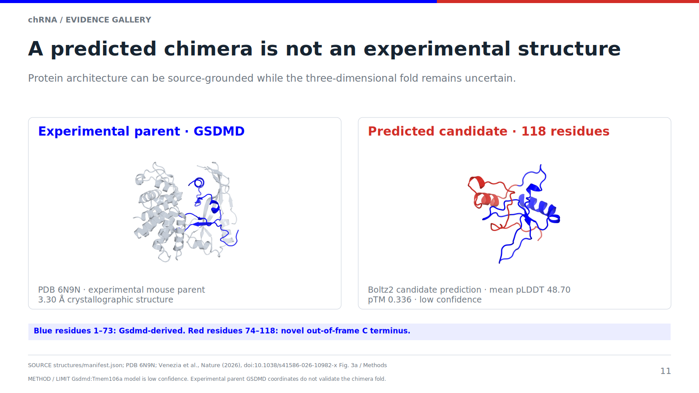
[Editable/vector figure](gallery/11_structure_evidence.svg)

**Generation.** The structure worker checked the BioNeMo OpenFold3/Boltz2 NIM skills first, then verified and reused an existing actual Boltz2 2.2.1 GPU prediction of the reconstructed 118-aa input. This was cached open-source Boltz2 inference, not a newly executed NIM call or the paper's AlphaFold 3 model. Sequence-to-coordinate identity and per-residue confidence were checked. Reproducible scripts, model coordinates, sequence/MSA, rendering parameters and source checksums are in `../structures/` and `scripts/structures/`.

The experimental comparison is mouse GSDMD PDB **6N9N**, a parental protein crystal structure, not a chimeric structure. Observed residues matching the retained 1–73 region are blue; other parent residues provide contextual structure. Positions 1 and 71–73 of that segment are not observed in the selected experimental chain and must not be filled in as experimental coordinates. The predicted chimera uses blue for residues 1–73 and red for 74–118. Each model is framed for legibility; apparent sizes and orientations are not a quantitative structural alignment.

**Interpretation.** The chimera model has mean pLDDT 48.70 and pTM 0.336. Its red tail has mean pLDDT 44.64; 53.4% of all residues are below pLDDT 50. These are **low-confidence prediction statistics**, not measured disorder percentages, validated conformational ensembles, or druggability scores. No RMSD-based accuracy claim is made against the parent, which is a different protein/construct. The visually detailed fold is illustrative of a model hypothesis, not reliable atomic structural ground truth. Candidate-specific protein models unavailable for the other RNA examples remain explicitly unavailable.

## 12. What the proof of concept establishes—and the next experiment

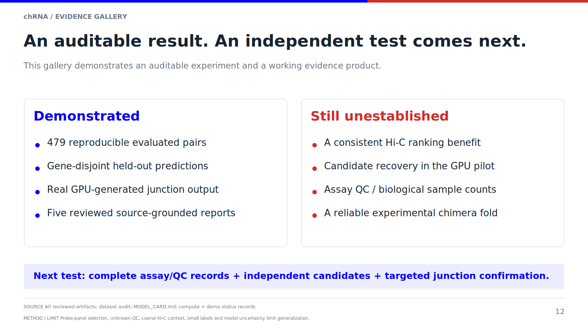
[Editable/vector figure](gallery/12_next_experiment.svg)

**Generation.** The final panel summarizes verified outputs: auditable reconstruction, a leakage-controlled held-out comparison, executed GPU alignment, source-grounded reports, and transparently labeled structural context. It separates these from candidate function, external generalization and druggability, which were not established.

**Interpretation.** The useful next test is an external candidate panel with explicit assay testing/QC and independent validation, followed by ORF-specific experiments where translation is plausible. A larger or more elaborate structure model cannot resolve missing RNA validation. The current result is an inspectable experiment with an inconclusive Hi-C increment.

## Source and provenance links

- [Venezia et al., Nature (2026)](https://www.nature.com/articles/s41586-026-10982-x): biological setup, Fig. 3a, and AlphaFold 3 structure methods.
- [RCSB PDB 6N9N](https://www.rcsb.org/structure/6N9N): experimental mouse GSDMD parent structure; deposited metadata are cached with the figure inputs.
- [Dataset audit](../dataset_reconstruction/audit.md), [model card](../classifier/MODEL_CARD.md), [GPU execution](../compute/pilot_summary.json), and [structure validation](../structures/validation.json).

The requested directory rename is documented separately. Dataset rows, folds, features, predictions and scientific metrics are unchanged; model-source provenance hashes were refreshed after the maintained path changed.
