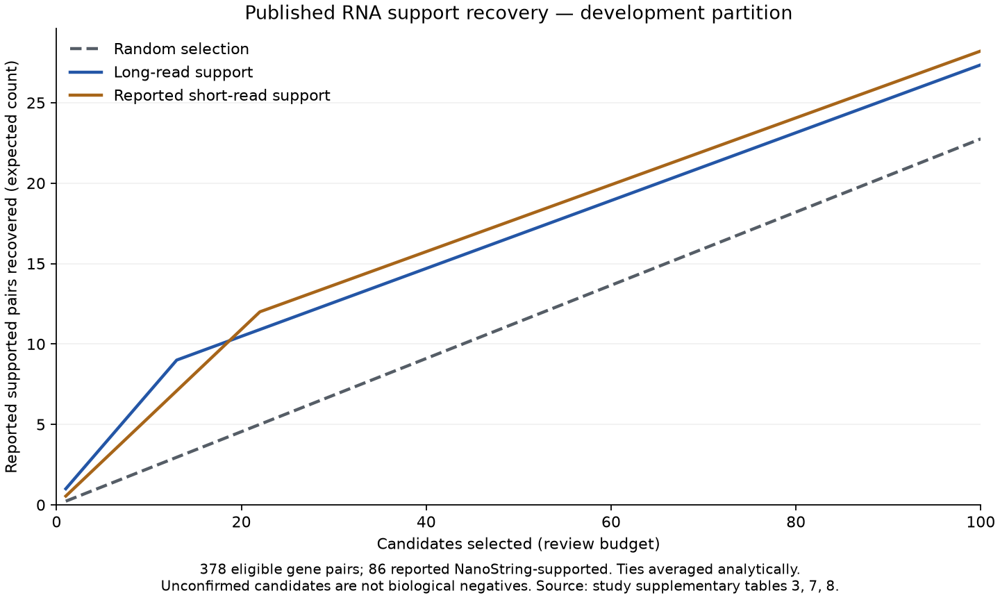

> **Current task context:** read [START_HERE.md](START_HERE.md) and [the focused execution goal](docs/execution_goal.md).

# Chimeric RNA prioritization

A reproducible pilot benchmark for recovering independently supported physiological chimeric RNAs from a candidate list.

The focused raw-read pilot has produced 116 supported exact RNA junctions and
Boltz-2 predictions for ten frozen reference-assisted protein hypotheses plus a
separate published architecture control. See the [focused report](reports/focused_pilot.html)
and its completion audit for verified artifacts and limitations. All selected
hypotheses are singletons in one steady-state sample; protein expression and
function remain unknown. The scope is defined by
[the agreed execution goal](docs/execution_goal.md). See the
[workspace index](START_HERE.md) and [focused runbook](docs/focused_pilot_runbook.md)
for current run records, reproducible commands and remaining stages. The pilot
results below are not results from that raw-read reproduction.

The study is [Venezia et al., *Functional chimeric mRNAs encode proteins in mammalian immunity*, Nature (2026)](https://doi.org/10.1038/s41586-026-10982-x). This project is independent of the paper's authors. It does not infer protein existence or function from RNA sequence alone.

## Current milestone

- Public source downloads with pinned SHA-256 checksums.
- A curated probe panel with separate features and published confirmation outcomes.
- Explicit records of unmatched names, probe variants and unavailable negative labels.
- Splits that keep shared parental genes and duplicate sequences together.
- Three baselines, analytical tie handling, a figure, tests and an executable notebook.
- A CPU-controller setup script for Brev and a documented compute budget policy.

No foundation model has been fine-tuned. The focused pilot adds GPU structure
inference; full-cohort analysis remains deferred. Published outcomes do not
provide a clean supervised biological-negative class.

## What the first audit found

| Quantity | Count |
| --- | ---: |
| Probe records | 529 |
| Distinct ordered gene pairs in the panel | 527 |
| Gene pairs listed as NanoString-supported | 109 |
| Panel pairs matched exactly to the main long-read catalogue | 479 |
| Unresolved catalogue matches | 48 |
| Known biological true negatives | 0 |

The 48 unresolved matches include one reverse-name match. We do not silently reverse genes or infer a junction match. Two pairs have multiple probe sequences. The supplied confirmation list is pair-level, so this first benchmark is **gene-pair-level**, not a validated classifier of exact junctions or individual reads. See [data contract](docs/data_contract.md) and [machine-readable audit](reports/data_audit.json).

## First baseline result

The development comparison uses 378 eligible pairs, including 86 reported NanoString-supported pairs. At a review budget of 20, the expected number of supported pairs recovered is:

| Ranking | Expected supported pairs in top 20 |
| --- | ---: |
| Random selection | 4.55 |
| Long-read support | 10.48 |
| Reported short-read support | 10.91 |

These fractional counts average over ties rather than picking a favorable arbitrary ordering. They are descriptive development results, not a trained-model gain, biological precision estimate or claim of new protein discovery. The reserved held-out partition has not been benchmarked.



## Run locally or on a CPU instance

Python 3.11 or later is required. The source inputs are small published spreadsheets, not raw sequencing archives.

```bash
python3 -m venv .venv
source .venv/bin/activate
python -m pip install -e '.[dev]'
chrna fetch
chrna build
pytest -q
chrna benchmark
chrna inspect Gsdmd:Tmem106a
```

For an explanatory case review, `chrna inspect Gsdmd:Tmem106a --include-published-outcomes` reveals the published outcome explicitly. Never give this revealed outcome to a benchmark ranker.

Open `notebooks/01_data_audit_and_baselines.ipynb` for the executed narrative and figures. The notebook can be rerun with `python scripts/make_notebook.py --execute`. It uses the same implementation as the CLI.

`requirements-lock.txt` records the environment used for the first run. Install it in a clean environment with `pip install -r requirements-lock.txt` and then `pip install -e . --no-deps` for that dependency set.

## Evaluation protocol

1. Use only `candidate_pairs.csv` and sequence records as inputs. Confirmation outcomes are stored separately.
2. Develop on folds 0–3. Fold 4 is reserved; shared genes and identical sequences cannot cross folds.
3. Compare all methods on the same eligible candidate pool.
4. Score recovery of **reported independently supported RNA pairs** at a fixed review budget.
5. Keep unconfirmed candidates biologically unknown. Do not report specificity, biological precision, FDR, or protein accuracy from these labels.
6. Freeze model, pooling, features and parameters before `chrna benchmark --partition heldout --evaluate-heldout`. This is a protocol guard, not an access-control boundary.

The panel was selected by the study authors and is not representative of all possible fusions. Generalization needs an external study. Model interpretation must distinguish biological plausibility from assay detectability and publication selection.

## Next milestones

1. Resolve the missing assay/QC metadata and candidate-name discrepancies.
2. Run one frozen RNA encoder on the published probe windows; record checkpoint, layer, pooling and sequence provenance.
3. Decide the learning objective after the label audit. Do not quietly use unconfirmed rows as biological negatives.
4. Compare any proposed ranking against the existing baselines on development data, then freeze it for held-out evaluation.
5. Connect the evidence tools to Rosalind/Codex using [workflow instructions](docs/agent_workflow.md).
6. Add one independent dataset only after the first end-to-end workflow works.

## Attribution and data

The original paper is open access under CC BY 4.0. Derived records retain its DOI, source names and row provenance. `data/sources.json` contains original URLs and hashes. Raw downloads are git-ignored and can be refetched. No private user data or credentials belong in this repository.

Public study accessions: mouse direct RNA GSE267147; human direct RNA GSE277057; mouse short-read RNA GSE324139; Hi-C GSE324391. A listing is not a claim that all raw sequencing data have been downloaded or analysed.
